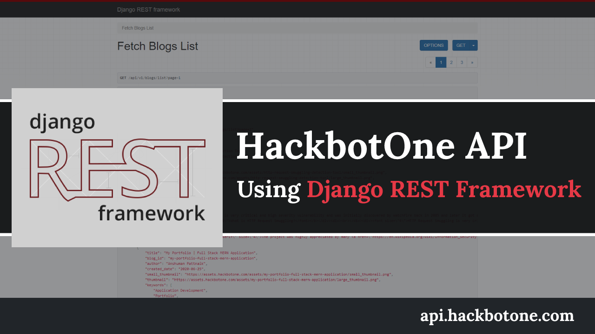
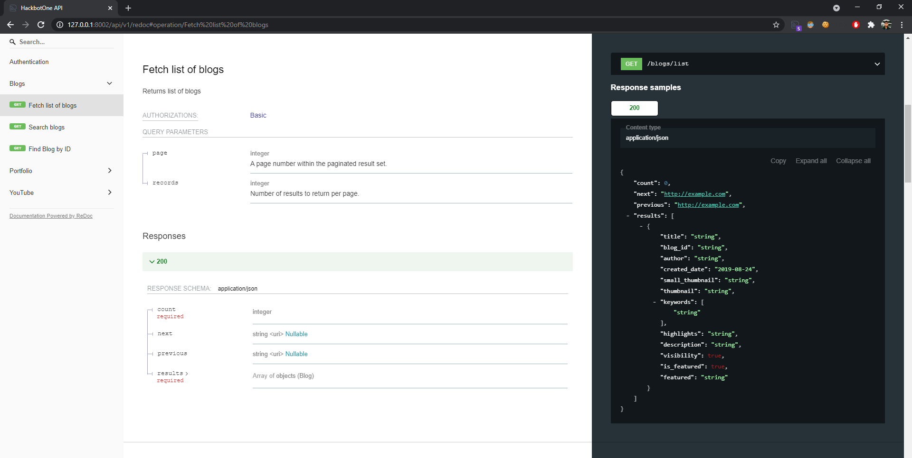

## Technical Overview
The implementation of HackbotOne REST API is done using django-rest-framework and internally it also implements PostgreSQL to store the data in the database. Three different types of microservices have been designed to store and retrieve the data from the database ([api/v1/blogs/](blogs), [api/v1/portfolio/](portfolio), [api/v1/youtube/](youtube)).

### Installation
````````````````````````````````````````````````````````````````
git clone https://github.com/anshumanpattnaik/hackbotone-api.git
cd hackbotone-api
python3 -m venv env
source env/bin/activate
pip3 install -r requirements.txt
python3 manage.py runserver 8002
````````````````````````````````````````````````````````````````

### Redoc API Documentation
The redoc API docs can be accessible via http://127.0.0.1:8002/api/v1/redoc for all the services and there is required of authentication to access the endpoints.



### Database Setup using pgAdmin
Make sure you have installed [PostgreSQL](https://www.postgresql.org/download/) & [pgAdmin](https://www.pgadmin.org/download/) software and then please follow the below steps to set up the database in your local machine.

### pgAdmin Database setup steps
````````````````````````````````````````````````````````````````
1. Create "hgit_admin" user with password "hgit_admin"
2. Create database "hgit" and assign the role to "hgit_admin"
````````````````````````````````````````````````````````````````

### Django Migrations
There are three different types of migration required for each table, so please follow the below steps for the migrations
````````````````````````````````````````````````````````````````
1. python3 manage.py makemigrations
2. python3 manage.py migrate
3. python3 manage.py makemigrations blogs
4. python3 manage.py migrate blogs
5. python3 manage.py makemigrations portfolio
6. python3 manage.py migrate portfolio
7. python3 manage.py makemigrations youtube
8. python3 manage.py migrate youtube
````````````````````````````````````````````````````````````````

### Import data using pgAdmin
There are three different CSV files that can be found under [databases](databases) folder in the repository and choose the respective file to import the data into the tables.

1. [blogs.csv](databases/blogs.csv)
2. [portfolio.csv](databases/portfolio.csv)
3. [youtube.csv](databases/youtube.csv)

### Note
If you are facing any issues or problems then feel free to raise an issue.

### Youtube Explantation
1. https://youtu.be/TRaejKHVhj8

### License
This project is licensed under the [MIT License](LICENSE)
